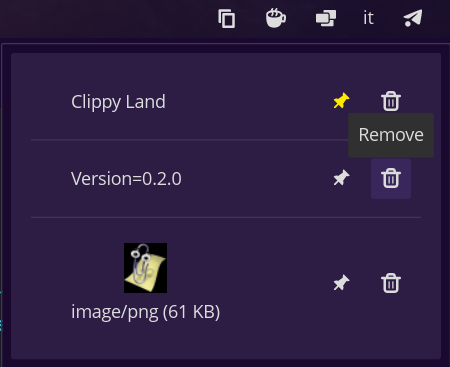

# clippy-land

COSMIC panel applet for keeping a history of recently copied text and images.

This applet polls the Wayland clipboard and updates the history when
the contents change.



Main features:

- Keep a history of the latest **30** clipboard entries (text + images)
- Re-copy an entry with a single click
- Remove individual entries from the history
- Pin important entries to the top of the history (5 pinned entries max)

## Dependencies

- Wayland clipboard support (via `wl-clipboard-rs`)
- Build dependencies for libcosmic on Debian-based systems:
  - cargo
  - cmake
  - just
  - pkg-config
  - libxkbcommon-dev
  - libwayland-dev
  - libgl1-mesa-dev
  - libssl-dev
  - libexpat1-dev
  - libfontconfig-dev
  - libfreetype-dev

## Build

```bash
cargo build --release
```

## Build/Install with just

```bash
# build
just build

# install for current user
just install

# install with custom paths
# (supported env vars: BIN_DIR, APP_DIR, ICON_DIR, METAINFO_DIR, EXEC_PATH)
# note: `just install` expands a leading `~/` in EXEC_PATH before writing the desktop `Exec=` line
BIN_DIR=~/.local/bin \
APP_DIR=~/.local/share/applications \
ICON_DIR=~/.local/share/icons/hicolor/scalable/apps \
METAINFO_DIR=~/.local/share/metainfo \
EXEC_PATH=~/.local/bin/cosmic-applet-clippy-land \
just install

# uninstall
just uninstall
```

## Install for Fedora

Thanks to [lorduskordus](https://github.com/lorduskordus) there is now an RPM package on COPR.

- [copr.fedorainfracloud.org/coprs/kordus/cosmic-applets](https://copr.fedorainfracloud.org/coprs/kordus/cosmic-applets)

Fedora Workstation

```sh
sudo dnf copr enable kordus/cosmic-applets
sudo dnf install cosmic-applet-clippy-land
```

Fedora Atomic

```sh
sudo wget -O /etc/yum.repos.d/_copr:copr.fedorainfracloud.org:kordus:cosmic-applets.repo https://copr.fedorainfracloud.org/coprs/kordus/cosmic-applets/repo/fedora/kordus-cosmic-applets.repo
rpm-ostree install cosmic-applet-clippy-land
```

## Usage

Open **COSMIC Settings → Desktop → Panel → Applets** and add “Clippy Land” to your panel.

## Notes

- App ID is currently `com.keewee.CosmicAppletClippyLand`

## Translations

Thanks to our community contributors, Clippy Land is available in the following languages:

- Italian ([k33wee](https://github.com/k33wee))
- **English** ([k33wee](https://github.com/k33wee))
- **Czech** ([lorduskordus](https://github.com/lorduskordus))
