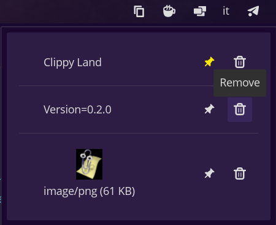

# clippy-land


COSMIC panel applet for keeping a history of recently copied text and images.

This applet listens for Wayland data-control selection events and updates the
history only when the clipboard contents change.



## Main features

- Keep a history of recent clipboard entries (text + images), with configurable limits
- Re-copy an entry with a single click
- Remove individual entries from the history
- Clear unpinned history entries with one click while keeping pinned entries saved
- Pin important entries to the top of the history; pinned entries persist across app restarts (configurable pin limit)
- In-popup **Settings** panel to adjust limits and apply them immediately:
  - max history entries
  - max pinned entries
  - max image byte size
  - max image dimensions
- Smooth row behavior for text and image entries:
  - text rows stay collapsed in-list and expose a lens button for a large full-text preview overlay inside the popup
  - image previews keep a fixed size and centered row actions for stable targeting
- Move between entries with keyboard ( **up/down** or **k/j** to navigate rows; **left/right** or **h/l** to move between row actions: copy, preview (when available), pin, delete)
- Keyboard activation and escape behavior:
  - press **Enter** on the focused action (including text preview lens)
  - while the text preview overlay is open, use **up/down** or **k/j** to scroll it
  - press **Q** to close the text preview overlay
  - press **Esc** to close the popup
- Adds keyboard shortcuts for opening the history (see [Usage](#usage) below)

## Table of Contents

- [Install from cosmic store](#cosmic-store)
- [Usage](#usage)
- [Settings](#settings)
- [Install with Flatpak](#install-with-flatpak)
- [Install for Debian/Ubuntu](#install-for-debianubuntu)
- [Install for Fedora](#install-for-fedora)
- [Build/Install with just](#buildinstall-with-just)
- [Testing](#testing)
- [Install with custom paths](#install-with-custom-paths)
- [Contributing docs](#contributing-docs)
- [Notes](#notes)

## Cosmic Store

The applet is officially published on [Cosmic Store](https://github.com/pop-os/cosmic-store). In COSMIC Store it should be under the "COSMIC Applets" category.

If it does not show up in your app store, you'll need to add `cosmic-flatpak` as a source:

```sh
flatpak remote-add --if-not-exists --user cosmic https://apt.pop-os.org/cosmic/cosmic.flatpakrepo
```

Just install it from the store and you'll have the flatpak sandbox installed!

## Usage

Open **COSMIC Settings → Desktop → Panel → Applets** and add "Clippy Land" to your panel.
You might need to log out and back in to see the applet in the list of available applets.

## Keyboard Shortcut

You can open the clipboard history with a keyboard shortcut via the `--toggle` flag.

Go to **COSMIC Settings → Keyboard → Custom Shortcuts**, add a new shortcut with:

- **Name:** Toggle ClippyLand
- **Command:** `cosmic-applet-clippy-land --toggle` (or `flatpak run io.github.k33wee.clippy-land --toggle` if installed via Flatpak)
- **Shortcut:** your preferred key combo (e.g. `Super+V`)

> **Note:** Due to a current limitation in the COSMIC panel, opening a popup without a pointer event (i.e. without actually clicking the applet icon) is not natively supported. As a workaround, `--toggle` opens the history as a full-width layer surface anchored to the top of the screen rather than as the usual dropdown under the icon. This is a known limitation and may be improved in the future once COSMIC panel exposes a proper API for this.

For local development, the binary also supports:

- `--standalone`: force open popup on startup
- `--no-standalone`: disable auto-open behavior

## Settings

You can open the in-popup settings panel with the gear button.

Settings are validated before apply/save. Current allowed ranges are:

- `max_history`: `30..=5000`
- `max_pinned`: `0..=500` and must be `<= max_history`
- `max_image_bytes`: `262144..=67108864`
- `max_image_dimension_px`: `512..=16384`

By default, Clippy Land starts with:

- `max_history = 200`
- `max_pinned = 20`
- `max_image_bytes = 8 MiB`
- `max_image_dimension_px = 8192`

Config is stored at `~/.config/clippy-land/config.toml` (or `$XDG_CONFIG_HOME/clippy-land/config.toml`), and can be overridden with `CLIPPY_LAND_CONFIG`.

Pinned clipboard entries are stored separately as app state so they survive app restarts and reboots. Only pinned entries are persisted; unpinned clipboard history remains runtime-only. Text pins are saved in a small TOML manifest, while pinned images store metadata in the manifest and image/thumbnail blobs beside it. By default, pinned history is stored at `$XDG_STATE_HOME/clippy-land/pinned-history.toml` or `~/.local/state/clippy-land/pinned-history.toml`, and can be overridden with `CLIPPY_LAND_PINNED_HISTORY`.

The **Clear History** action removes only unpinned entries. To remove a pinned entry, unpin it or delete that entry directly.

## Install with Flatpak

1. Add the required remotes (if not already added):

```bash
flatpak remote-add --if-not-exists flathub https://flathub.org/repo/flathub.flatpakrepo
```

2. Download the latest `.flatpak` from the [releases page](https://github.com/k33wee/clippy-land/releases/).
3. In a terminal, navigate to the directory where you downloaded the `.flatpak` file and run:

```bash
flatpak install --user ./clippy-land_<version>.flatpak
```

This will install the applet for your user. If you encounter missing runtime errors, ensure the remotes above are added and try again.

## Install for Debian/Ubuntu

Download the latest .deb from the [releases page](https://github.com/k33wee/clippy-land/releases/):
In a terminal, navigate to the directory where you downloaded the .deb file and run:

```bash
sudo apt install ./cosmic-applet-clippy-land_<version>_amd64.deb
```

The packaged desktop entry now points directly at `/usr/bin/cosmic-applet-clippy-land`, so COSMIC will not accidentally launch an older binary from your `$PATH` during upgrades.

## Install for Fedora

Thanks to [lorduskordus](https://github.com/lorduskordus) there is now an RPM package on COPR.

- [copr.fedorainfracloud.org/coprs/kordus/cosmic-applets](https://copr.fedorainfracloud.org/coprs/kordus/cosmic-applets)

Traditional Fedora

```sh
sudo dnf copr enable kordus/cosmic-applets
sudo dnf install cosmic-applet-clippy-land
```

Fedora Atomic

```sh
sudo wget \
    https://copr.fedorainfracloud.org/coprs/kordus/cosmic-applets/repo/fedora/kordus-cosmic-applets.repo \
    -O /etc/yum.repos.d/_copr:copr.fedorainfracloud.org:kordus:cosmic-applets.repo
rpm-ostree install cosmic-applet-clippy-land
```

## Build/Install with just

### Dependencies

- Wayland clipboard support (via `wl-clipboard-rs`)
- Build dependencies for libcosmic:

```bash
sudo apt install cargo cmake just libexpat1-dev libfontconfig-dev libfreetype-dev libxkbcommon-dev pkgconf
```

```bash
# build
just build

# install system-wide under /usr
sudo just install

# uninstall the system-wide source install
sudo just uninstall
```

`just install` now renders the desktop entry with an absolute `Exec=` path for the chosen prefix, so the applet launcher stays tied to that exact install instead of whichever `cosmic-applet-clippy-land` happens to appear first in `$PATH`.

## Testing

Use the provided `just` recipes:

```bash
# unit/integration tests
just test

# tests intended for Wayland runtime environments
just test-wayland

# end-to-end Wayland interaction checks
just e2e
```

E2E tests require a Wayland session and helper tools such as `wl-copy`, `wl-paste`, and `wtype`.

## Contributing docs

- For issue reporting and panel-log collection, see [DEBUGGING.md](./DEBUGGING.md).
- For adding or updating translations, see [TRANSLATION.md](./TRANSLATION.md).

## Install with custom paths

Pass a `prefix` variable to install everything under a custom root:

```bash
# install under ~/.local for the current user without sudo
just prefix="$HOME/.local" install

# uninstall the current user's ~/.local source install
just uninstall-user

# equivalent explicit form
just prefix="$HOME/.local" uninstall
```

If an older user-local install was created with `sudo just prefix=~/.local install`, its files may be owned by root. Remove that old root-owned local install once with `sudo just prefix="$HOME/.local" uninstall`, then use the non-sudo `~/.local` commands above for future user-local installs.

All paths are derived from `prefix`:

| Path                                         | Default                  |
| -------------------------------------------- | ------------------------ |
| `<prefix>/bin`                               | binary + launcher script |
| `<prefix>/share/applications`                | `.desktop` file          |
| `<prefix>/share/icons/hicolor/scalable/apps` | app icon                 |
| `<prefix>/share/metainfo`                    | MetaInfo file            |
| `<prefix>/share/licenses/<appid>`            | license                  |

If you previously installed Clippy Land under `~/.local` and then switched to the `.deb` or another system install, remove the older user-local install first with `just uninstall-user`. Per the desktop entry spec, a user-local desktop file with the same ID overrides the system one, and older applet installs could also leave behind a stale `~/.local/bin/cosmic-applet-clippy-land` binary.

## Notes

- App ID is currently `io.github.k33wee.clippy-land`.
- Debug wrapper log path defaults to `${XDG_STATE_HOME:-$HOME/.local/state}/clippy-land/panel-debug.log`.

## Attribution

- "Cosmic Icons" by System76 is licensed under CC-SA-4.0
